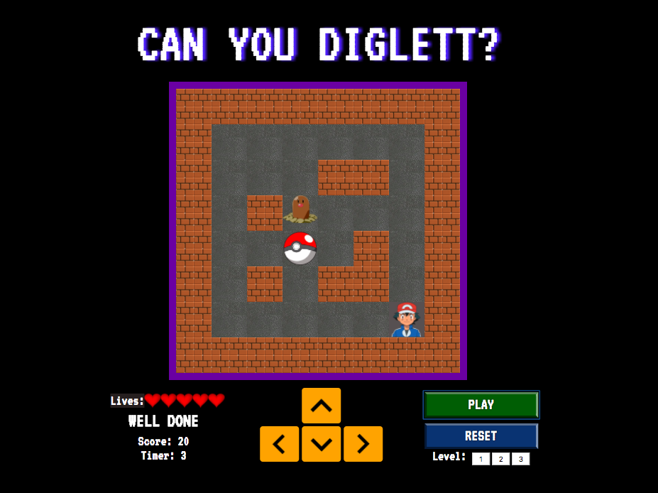

#  WDI PROJECT 1: JavaScript Game - 'Can You Diglett?'

Adding additional features to WDI_PROJECT_1 - **[http://wdi40-project-1.s3-website-ap-southeast-2.amazonaws.com/](http://wdi40-project-1.s3-website-ap-southeast-2.amazonaws.com/)**

## SUMMARY

My first project at GA was to build an interactive game using JavaScript and jQuery for `DOM` manipulation. This was my first opportunity to apply my early JS knowledge to a working app and to also apply CSS styling to my own product.

### Programming and Technology Library:

* HTML5
* CSS3
* jQuery
* JavaScript
* PHP
